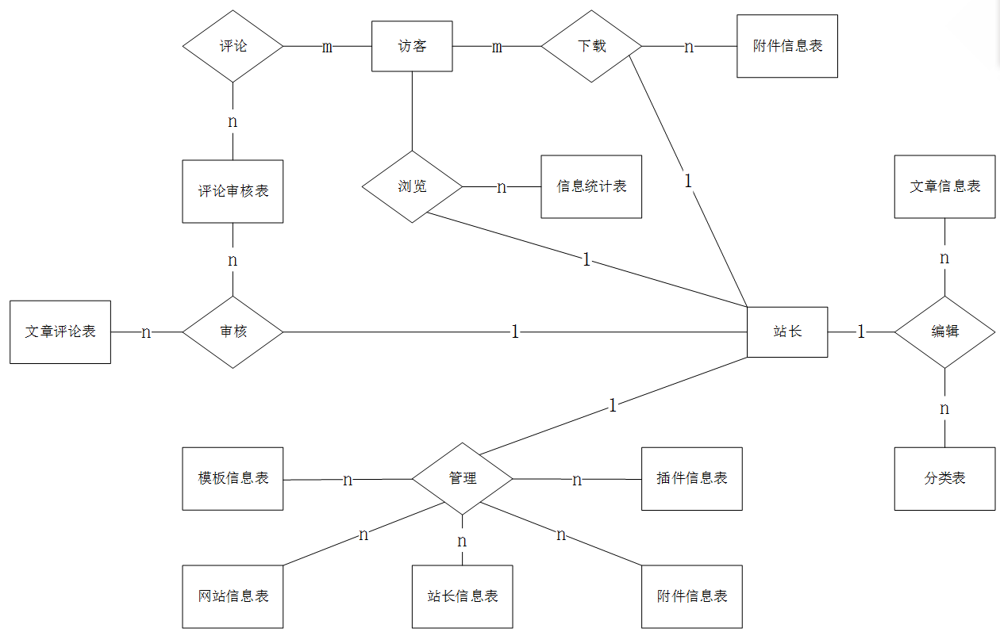

# **愿景和范围文档**
## **1.业务需求**
### **1.1 背景**
近年来随着信息技术的进步，Blog（音译博客）也快速发展。为人们提供了一个自由、开放、互动的交流平台。博客不仅可以帮助个人实现自我表达和展示，也可以为企业、政府、媒体等机构提供一个有效的宣传和传播渠道。沟通方式比电子邮件、讨论群组以及BBS和论坛更展现个性，博客系统已经成为广大用户发表文章言论的主要工具，同时，博客也为网络营销、个人品牌建设、知识分享等方面提供了有力的支持。
### **1.2 业务机遇**
内容创作：博客本身就是以内容为核心的平台，因此，对于擅长写作的人来说，博客提供了一个很好的机会来展示自己的才华和技能。通过不断更新高质量、有价值的内容，博客可以吸引更多的读者，进而获得更多的关注和流量。

营销推广：博客可以作为一个宣传和推广产品或服务的平台，通过博客上的内容来吸引潜在客户的注意，提高品牌知名度和产品销售。

广告收入：博客也可以通过在内容中嵌入广告或推广合作，获得广告收入。例如，博主可以通过展示谷歌广告或加入广告联盟等方式来获得广告收入。

会员订阅：博主可以通过提供独家内容、优惠福利、专业服务等方式来吸引粉丝成为会员，从而获得稳定的收入。

品牌合作：博主可以通过与品牌进行合作，为品牌提供曝光和宣传，从而获得一定的收益。
### **1.3 业务目标**
BO-1：提高网站流量：通过优化博客的SEO，定期发布高质量、有价值的内容，积极推广博客，吸引更多的访问者，提高网站流量。

BO-2：提高用户留存率：通过提供个性化的用户体验，例如定期推送订阅邮件、社交媒体分享等方式，增强用户的参与感和忠诚度，提高用户留存率。

BO-3：增加粉丝数量：通过各种社交媒体平台和其他渠道宣传博客，积极与读者互动，增加粉丝数量。可以通过提供独家内容、优惠福利等方式吸引更多的用户成为粉丝。

BO-4：扩大品牌影响力：通过与其他博主、品牌进行合作，参与各种行业活动和社区活动，扩大博客的品牌影响力。

BO-5：增加收益：通过各种方式如会员订阅、广告收入、品牌合作等，增加博客的收益。可以通过谷歌广告等广告平台、知名电商平台等方式，获取更多的收益。

### **1.4 成功指标**
SM-1：在发布6个月之后，博客的流量达到每月数万或数十万的访问量，且这些访问量是有价值的。

SM-2：在发布6个月之后，收益达到每月数万，收益与流量、粉丝数量匹配，即每一万流量或每一百个粉丝所产生的收益能够达到一定的目标。

### **1.5 愿景陈述**
博客应具有积极的社会意义和价值，提供一个平台为读者提供有用的信息和知识，或者帮助读者解决实际问题等。也可以成为特定领域的权威博客，或者成为特定群体的首选博客等。博客的受众是博客的目标读者群体，博客的影响范围则是博客所影响的人群和领域。做到全国第一的博客

### **1.6业务风险**
RI-1：博客的内容可能存在侵权、虚假宣传、违反社会公德等问题，导致法律风险和声誉风险。（概率=0.8；影响=4）

RI-2：博客的流量可能受到搜索引擎算法变化、社交媒体政策调整等因素的影响，导致流量的急剧下降。（概率=0.4；影响=3）

RI-3：博客所在的行业和领域可能存在激烈的竞争，其他博客可能通过价格战、品牌宣传等手段抢占市场份额。（概率=0.6；影响=5）

RI-4：博客所处的政策环境可能发生变化，例如出台新的网络安全法规、版权法规等，导致博客需要承担额外的合规成本和责任。（概率=0.2；影响=2）

### **1.7 业务假设和依赖**
AS-1：系统为用户们提供了个性化的用户界面，用户可以根据个性需求装扮界面。

AS-2：服务器可以承受上千人的访问量，并且检测博客是否合规并上传的时间控制在30分钟以内。

## **2.范围和限制**
### **2.1主要特性**
FE-1：发表，修改，取消或删除和查看已经发表的博客。

FE-2：审核和删除发表的博客。

FE-3：为经常访问的博客进行博客订阅，删除和取消。

FE-4：授权员工管理员可通过企业内网，互联网，智能手机以及平板电脑访问系统。

FE-5：可查阅博客的订阅数量

### **2.2初始与后序发布的范围**
<!--以后填写-->

### **2.3限制项和排除项**
无

## **3.业务上下文**

### **3.1干系人资料**

### **3.2部署考虑**
    需要为ios和安卓系统的智能手机和平板开发应用，相应的windows phone和windows 平板电脑在随后的发布中完成开发。需要制作一系列的长度短于5分支的视频，用于培训管理人员如何基于互联网和版本应用的。

# **用例**

**个人博客网站的主要操作者及用例**

|主要操作者|用例|
|---|---|
|游客|1.浏览文章 2.评论文章 3.下载附件|
|站主|1.登录 2.注销 3.发表文章 4.修改文章 5.删除文章 6.上传附件 7.删除附件|

-----------
## **用例图**

---------
## **具体用例**

1. **发表文章**

    |用例名称|发表文章|
    |---|---|
    |参与者|站主|
    |前置条件|站主必须登录|
    |后置条件|文章发表成功|
    |主事件流|1.站主点击发表文章按钮 2.站主填写文章信息 3.系统保存文章信息 4.系统提示发表成功 |
    |备选事件流|3a.系统检测到文章信息有误 3a1.系统提示文章信息有误 3a2.系统返回文章填写页面 3a3.站主修改文章信息 3a4.系统保存文章信息 3a5.系统提示发表成功 |

2. **上传附件**

    |用例名称|上传附件|
    |---|---|
    |参与者|站主|
    |前置条件|站主必须登录|
    |后置条件|附件上传成功|
    |主事件流|1.站主点击上传附件按钮 2.站主选择附件 3.系统保存附件信息 4.系统提示上传成功 |
    |备选事件流|3a.系统检测到附件信息有误 3a1.系统提示附件信息有误 3a2.系统返回附件填写页面 3a3.站主修改附件信息 3a4.系统保存附件信息 3a5.系统提示上传成功 |

3. **发表评论**

    |用例名称|发表评论|
    |---|---|
    |参与者|游客|
    |前置条件|无|
    |后置条件|评论发表成功|
    |主事件流|1.游客点击发表评论按钮 2.游客填写评论信息 3.系统保存评论信息 4.系统提示发表成功 |
    |备选事件流|3a.系统检测到评论信息有误 3a1.系统提示评论信息有误 3a2.系统返回评论填写页面 3a3.游客修改评论信息 3a4.系统保存评论信息 3a5.系统提示发表成功 |

4. **发表留言**

    |用例名称|发表留言|
    |---|---|
    |参与者|游客|
    |前置条件|无|
    |后置条件|留言发表成功|
    |主事件流|1.游客点击发表留言按钮 2.游客填写留言信息 3.系统保存留言信息 4.系统提示发表成功 |
    |备选事件流|3a.系统检测到留言信息有误 3a1.系统提示留言信息有误 3a2.系统返回留言填写页面 3a3.游客修改留言信息 3a4.系统保存留言信息 3a5.系统提示发表成功 |

5. **登录**

    |用例名称|登录|
    |---|---|
    |参与者|站主|
    |前置条件|无|
    |后置条件|登录成功|
    |主事件流|1.站主点击登录按钮 2.站主填写登录信息 3.系统保存登录信息 4.系统提示登录成功 |
    |备选事件流|3a.系统检测到登录信息有误 3a1.系统提示登录信息有误 3a2.系统返回登录填写页面 3a3.站主修改登录信息 3a4.系统保存登录信息 3a5.系统提示登录成功 |

6. **注销**

    |用例名称|注销|
    |---|---|
    |参与者|站主|
    |前置条件|站主必须登录|
    |后置条件|注销成功|
    |主事件流|1.站主点击注销按钮 2.系统提示注销成功 |

7. **修改文章**

    |用例名称|修改文章|
    |---|---|
    |参与者|站主|
    |前置条件|站主必须登录|
    |后置条件|文章修改成功|
    |主事件流|1.站主点击修改文章按钮 2.站主修改文章信息 3.系统保存文章信息 4.系统提示修改成功 |
    |备选事件流|3a.系统检测到文章信息有误 3a1.系统提示文章信息有误 3a2.系统返回文章填写页面 3a3.站主修改文章信息 3a4.系统保存文章信息 3a5.系统提示修改成功 |

8. **删除文章**

    |用例名称|删除文章|
    |---|---|
    |参与者|站主|
    |前置条件|站主必须登录|
    |后置条件|文章删除成功|
    |主事件流|1.站主点击删除文章按钮 2.系统提示删除成功 |

------

# **软件需求规范**

## 1. **介绍**
    
### 1.1 **目的**

基于个人博客的特点，本系统实现个人博客的主要功能，包括博客系统的站主登录/退出，博客站主并发表文章、图片等，游客发表评论、分页浏览文章和下载文章附件等。博客系统主要区分了两类用户，分别为博客站主和普通游客。网站登录仅限于博客站主，博客站主可以登陆写下自己的文章与上传附件，登陆即拥有网站管理的权限，未登录时均以游客身份访问。游客主要的功能是分页、分类、分标签阅读博客站主文章和浏览图片，发表评论和留言。

### 1.2 **项目范围**

个人博客将提供一个网站给站主写博客，为游客提供阅读，下载附件，评论的功能
-------------------
## 2. **总述**

### 2.1 **产品视角**

个人博客

### 2.2 **用户类别及特征**

| 用户类别 | 描述 |
|   ---   | ---  |
| 游客 | 查看，转发，评论站主发布的文章 |
| 站主 | 添加，修改，删除文章，维护网站 |

### 2.3 **操作环境**

正常浏览器

### 2.4 **设计与实现约束**

- 使用html，css，js语言做前端，加上bootstrap框架
- 使用java语言做后端
- 使用mysql数据库

### 2.5 **假设与依赖**

- 站主的服务器有充足的容量存储数据
- 站主的服务器运行正常
-------------------
## 3. **系统特性**

### 3.1 **游客浏览，评价  **

- 游客浏览会产生浏览记录，可以添加到数据库中

- 游客评价会添加到数据库中，游客可以使用临时名进行评价，并记录评价时间来排序

### 3.2 **站主文章管理，发表、修改、上传**

- 站主使用Markdown格式书写内容，保存在数据库中，网页访问时通过js获取api，并转换成html格式显示

- 可以对已有的内容进行修改

- 文章对图片和附件进行直接的引用，即图片和附件信息不通过数据库存储

### 3.3 **系统设计方法**

- 系统为博客网站站主提供专门的登录界面，不为浏览网站的用户提供登陆界面，亦不包括登陆后的管理界面

- 浏览用户仅有浏览网页、下载指定附件的功能，除评论功能外，不涉及对博客网站系统后台数据库表的修改

- 博客站主需输入密码方可登陆，登陆后可进行各种管理操作。博主的密码通过rsa256算法加密保存在服务器端，加强安全性

-------------------

## 4. **数据需求**

### 4.1 **ER图**

### 4.2 **数据流图**

### 4.3 **数据库表**

*仅针对首次迭代进行数据库建模*

1. **站长信息表**

    |属性名|数据类型|约束条件|注释|
    |---|---|---|---|
    |id|int|主键|站长id|
    |name|varchar(20)|唯一|站长名|
    |password|password||站长密码|
    |email|varchar(30)||站长邮箱|
    |img|图片信息表.id|外键|站长头像|
    |description|varchar(100)||站长描述|
    
    

2. **文章信息表**

    |属性名|数据类型|约束条件|注释|
    |---|---|---|---|
    |id|int|主键|文章id|
    |title|varchar(100)||文章标题|
    |content|longtext||文章内容|
    |time|datetime||文章发表时间|
    |author|varchar(20)||文章作者|
    |type|varchar(10)||文章类型|
    |tag|varchar(20)||文章标签|
    
    
3. **评论信息表**

    |属性名|数据类型|约束条件|注释|
    |---|---|---|---|
    |id|int|主键|评论id|
    |name|varchar(20)||评论者名|
    |content|varchar(100)||评论内容|
    |time|datetime||评论时间|
    |article|文章信息表.id|外键|评论文章|

    
4. **附件信息表**

    |属性名|数据类型|约束条件|注释|
    |---|---|---|---|
    |id|int|主键|附件id|
    |name|varchar(20)||附件名|
    |content|longblob||附件内容|
    |time|datetime||附件上传时间|
        

-------------------
## 5. **外部接口需求**
    
### 5.1 **用户界面**

- 网站首页
- 文章列表页
- 文章详情页
- 图片列表页
- 图片详情页
- 附件列表页
- 附件详情页
- 留言页
- 评论页
- 登陆页
- 注册页
- 管理页

### 5.2 **软件接口**

- 上传附件
- 下载附件
- 上传图片
- 下载图片
- 上传文章
- 修改文章
- 删除文章
- 添加评论
- 删除评论
- 添加留言
- 删除留言
- 登陆
- 注册
- 修改密码
- 修改信息
- 退出

-------------------

## 6. **质量属性**
    
### 6.1 **易用性要求**

- 罗列博客的所有内容，可以按照文章属性排序
- 提供搜索功能

### 6.2. **性能要求**

- 尽可能快的响应

### 6.3 **防护要求**

- 保护站主密码

